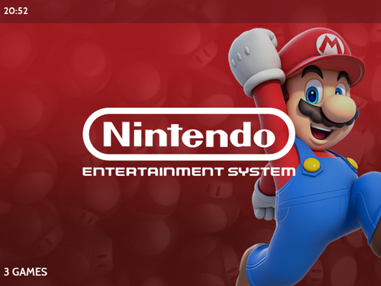
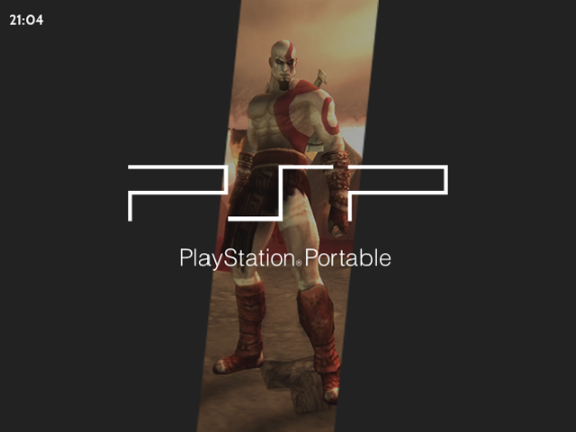
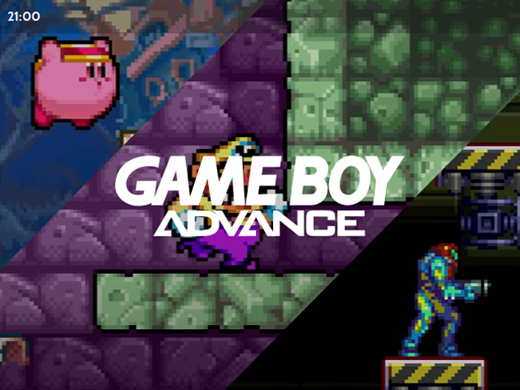
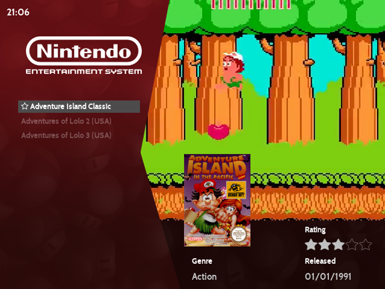

# Default Theme List

- [Device - RG351V / RG351MP](#art-book-43)
- [Device - RG351P / RG351M](#art-book-32)

***

## Art Book 4:3

### Basic Informations

**Description:** Fork of [3:2 theme](#art-book-32) with multiple new options like Airen view, toggles for colors or font size. 
It was specialy designed for 640x480 with 4:3 aspect ratio

**Github:** [Link](https://github.com/szalik-rg351/es-theme-art-book-4-3) 

**Author:** [Szalik](https://github.com/szalik-rg351) 

**Credit:** [anthonycaccese](https://github.com/anthonycaccese)  for base 3:2 theme

### Preview for Backgrounds

* _Fullscreen_ 

{: width="320" height="240"}

* _Centered_ 

{: width="320" height="240"}

* _Screenshots_ ( Work in Progress ) 

{: width="320" height="240"}

### Preview for metadata

* _Metadata - Airen_ with Fullscreen backgrounds enabled

{: width="320" height="240"}

* _Metadata - Airen_ with Centered / Screenshots backgrounds enabled

{: width="320" height="240"}

### Configuration
- Background Art: Toggle background art for system view under "UI Settings" > "Theme Configuration" > "Background Art" (video: https://youtu.be/YgpRxBTLgCU)
  - Options:
  - [Off] Don't display background art
  - [Centered] Display centered background art
  - [Full Screen] Display full screen background art
- Metadata: Toggle metadata display for games view under "UI Settings" > "Theme Configuration" > "Metadata" (video: https://youtu.be/tCDM-nLCjQI)
  - Options:
  - [Off] Don't display game metadata
  - [On] Display the following game metadata - Title, Description, Rating, Release Date

***

## Art Book 3:2

### Descritpion
A simple theme for Emulation Station based on the look of a coffee table book.  Built and tested on 351Elec for the RG351P handheld.  
Discussion for the base Art book theme is ongoing in this thread: https://retropie.org.uk/forum/topic/11728/new-theme-art-book

### Preview

* Fullscreen - System view

{: width="320" height="240"}

* *Video View*

{: width="320" height="240"} 

* *Detailed View*

{: width="320" height="240"}

* *Grid View*

{: width="320" height="240"} 

### Configuration
- Background Art: Toggle background art for system view under "UI Settings" > "Theme Configuration" > "Background Art" (video: https://youtu.be/YgpRxBTLgCU)
  - Options:
  - [Off] Don't display background art
  - [Centered] Display centered background art
  - [Full Screen] Display full screen background art (created by Szalik)
- Metadata: Toggle metadata display for games view under "UI Settings" > "Theme Configuration" > "Metadata" (video: https://youtu.be/tCDM-nLCjQI)
  - Options:
  - [Off] Don't display game metadata
  - [On] Display the following game metadata - Title, Description, Rating, Release Date
